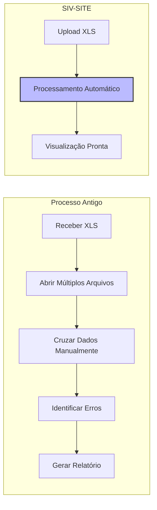
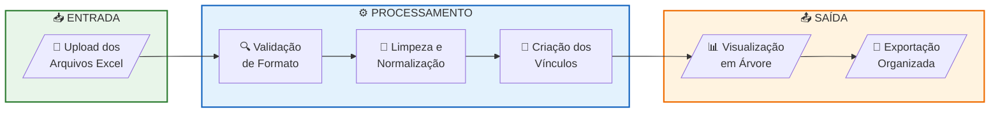
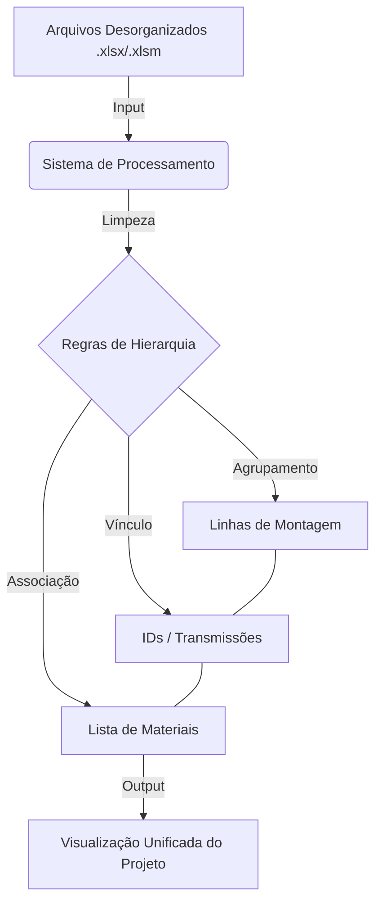

  <h1>Sistema de Integração e Visualização de Projetos (SIV-SITE)</h1>
  
  

    Uma solução para centralização, tratamento e visualização hierárquica de dados de montagem e listas de materiais.
  

  
  
  
    

  <h3>Tecnologias & Ferramentas</h3>
  
  
  
   
  
  
   
  

 

  
Sumário

  <ol>
    <li><a href="#-sobre-o-projeto">Sobre o Projeto</a></li>
    <li><a href="#-o-desafio-problema">O Desafio (Problema)</a></li>
    <li><a href="#-a-solução">A Solução</a></li>
    <li><a href="#-benchmarking--impacto">Benchmarking & Impacto</a></li>
    <li><a href="#️-jornada-do-usuário">Jornada do Usuário</a></li>
    <li><a href="#️-arquitetura-e-fluxo-de-dados">Arquitetura e Fluxo</a></li>
  </ol>

---

## 📄 Sobre o Projeto

Este projeto visa resolver gargalos operacionais no **Departamento de SITE (Instalações)**, focando na otimização da leitura e interpretação de dados de projetos de engenharia. O sistema atua como uma ferramenta de **ETL (Extract, Transform, Load)** e visualização, processando arquivos brutos para gerar uma visão unificada das linhas de montagem.

## 🚩 O Desafio (Problema)

Atualmente, a gestão de dados no departamento enfrenta dificuldades críticas relacionadas à fragmentação da informação:

* **Visualização Fragmentada:** Ausência de uma visão holística (Overview) das linhas de montagem dos projetos recebidos.
* **Descentralização de Materiais:** As planilhas de Lista de Materiais (BOM - Bill of Materials) são recebidas separadamente, dificultando o cruzamento de dados com o cronograma ou o projeto físico.
* **Inconsistência de Dados (Input):** Os arquivos de entrada (`.xlsx` ou `.xlsm`) carecem de padronização, apresentando formatação desorganizada que impede a análise direta.
* **Complexidade de Relacionamento:** Dificuldade extrema em agrupar dados interligados (ex: relacionar um ID de transmissão específico com sua respectiva lista de materiais e linha de montagem).

## 💡 A Solução

O sistema propõe uma arquitetura de processamento inteligente que ingere arquivos desestruturados e devolve informações organizadas logicamente.

### Objetivos Principais

1. **Centralização de Inputs:** Recebimento unificado de arquivos `.xlsx` e `.xlsm`.
2. **Processamento Lógico:** Aplicação de algoritmos de "limpeza" e organização baseados em regras de negócio pré-definidas.
3. **Estruturação Hierárquica:** Agrupamento automático de dados seguindo a árvore lógica do projeto:
   - *Linhas de Montagem* ➔ *Transmissões (IDs)* ➔ *Listas de Materiais (BOM)*.
4. **Visualização Otimizada:** Interface ou saída de dados que permite ao usuário visualizar o projeto de forma macro e micro, com todas as dependências corretamente vinculadas.

---

## 📊 Benchmarking & Impacto

Comparativo de eficiência entre o processo manual atual e a automação proposta pelo SIV-SITE.

| Métrica | Processo Atual (Manual) | SIV-SITE (Automatizado) | Melhoria Estimada |
| :--- | :--- | :--- | :---: |
| **Tempo de Análise** | Horas (Agrupamento manual) | Minutos (Processamento auto) | 🔽 **90%** |
| **Integridade de Dados** | Alta propensão a erro humano | Validação lógica por código | 🔼 **Alta** |
| **Visualização** | Planilhas desconexas | Dashboard Unificado | ✅ **Total** |

### Redução de Complexidade

---

## 🗺️ Jornada do Usuário

Abaixo, o fluxo simplificado da experiência do engenheiro ao utilizar a plataforma:

**Legenda:**
| Etapa | Responsável | Descrição |
|:---:|:---:|:---|
| 📥 Entrada | Engenheiro | Upload dos arquivos `.xlsx` ou `.xlsm` |
| ⚙️ Processamento | Sistema | Validação, limpeza e criação de vínculos hierárquicos |
| 📤 Saída | Engenheiro | Visualização dos dados e exportação organizada |

---

## ⚙️ Arquitetura e Fluxo de Dados

O núcleo do software baseia-se em um fluxo rigoroso de tratamento de dados:

1. **Ingestão (Input):** Carregamento dos arquivos brutos (Excel).
2. **Normalização:** O sistema identifica colunas chave e remove inconsistências.
3. **Mapeamento de Hierarquia:**
   - Identificação das Linhas Principais.
   - Associação dos IDs de Transmissão às linhas.
   - Vinculação dos itens da Lista de Materiais aos seus respectivos IDs.
4. **Renderização (Output):** Exibição dos dados agrupados e saneados para tomada de decisão.

---

  
Documentação desenvolvida pela equipe de Engenharia de Dados - SITE.

